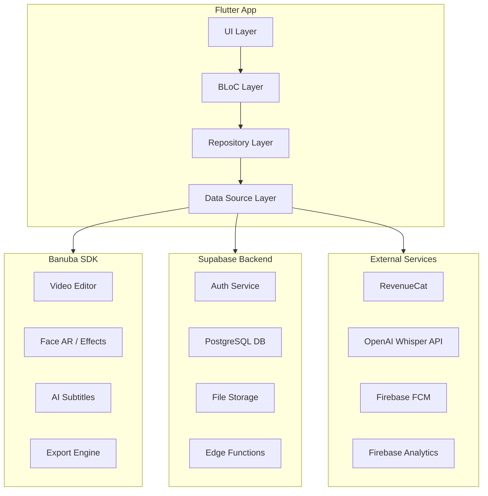
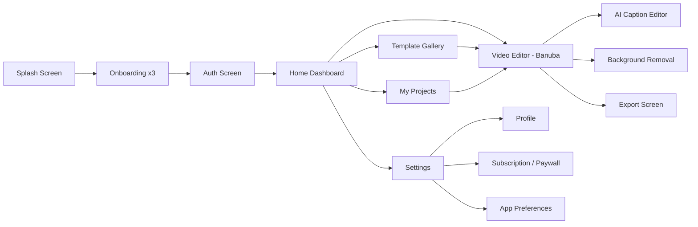

# ClipAI - Product Requirements Document (PRD)

---

## 1. Product Overview

**App Name:** ClipAI
**Tagline:** "Create Crazy Videos in Seconds"
**Platform:** Android + iOS (Flutter)
**Category:** Video Editing / AI Tools

ClipAI is a beginner-friendly, AI-powered video editing app that enables content creators, influencers, and everyday users to create professional-quality short-form videos (Reels, Shorts, TikToks) with minimal effort. The app focuses on simplicity, speed, and AI automation.

---

## 2. Target Users

- **Content Creators / Influencers** - Need fast, professional edits for Instagram Reels, YouTube Shorts, TikTok
- **Small Business Owners** - Create promotional short videos without hiring an editor
- **Beginners** - People with zero editing experience who want polished results
- **Social Media Enthusiasts** - Normal people wanting to create trending/viral content

---

## 3. Monetization Strategy (Recommended: Freemium)

| Tier            | Price     | Features                                                                            |
| --------------- | --------- | ----------------------------------------------------------------------------------- |
| **Free**        | $0        | Basic editing, 3 templates, Banuba AI captions, 720p export, watermark              |
| **Pro Monthly** | $9.99/mo  | All templates, HD/4K export, no watermark, background removal, advanced AI captions |
| **Pro Yearly**  | $59.99/yr | Everything in Pro Monthly (50% savings)                                             |
| **Lifetime**    | $99.99    | One-time purchase, all Pro features forever                                         |

Use **RevenueCat** for subscription management (handles both App Store + Google Play).

---

## 4. Tech Stack

```
Frontend:        Flutter 3.19+ / Dart 3.3+
State Mgmt:      flutter_bloc (BLoC pattern)
Backend:         Supabase (Auth, Database, Storage, Edge Functions)
Video SDK:       Banuba Video Editor SDK (ve_sdk_flutter)
AI Captions:     Phase 1: Banuba built-in AI subtitles
                 Phase 2: OpenAI Whisper API (premium feature)
Subscriptions:   RevenueCat (purchases_flutter)
Analytics:       Firebase Analytics + Crashlytics
Push Notifs:     Firebase Cloud Messaging (FCM)
Deep Links:      Firebase Dynamic Links
Local Storage:   Hive / SharedPreferences
```

---

## 5. Architecture



**Data Flow:**

1. User opens app -> Auth via Supabase (email, Google, Apple Sign-In)
2. User selects template or starts blank project -> Banuba SDK handles editing
3. AI captions generated -> Banuba built-in (free) or Whisper API (pro)
4. Export -> Banuba Export Engine -> saves to device gallery
5. User metadata, templates, projects stored in Supabase PostgreSQL
6. Subscription status checked via RevenueCat

---

## 6. Feature Breakdown

### Phase 1 - MVP (Month 1)

| Feature                | Description                                                           | Priority |
| ---------------------- | --------------------------------------------------------------------- | -------- |
| **Onboarding**         | 3-screen intro explaining app features                                | P0       |
| **Auth**               | Email/Password + Google Sign-In + Apple Sign-In via Supabase          | P0       |
| **Home Screen**        | Dashboard with quick actions: New Project, Templates, Recent Projects | P0       |
| **Video Editor**       | Banuba SDK integration - trim, merge, filters, text overlay, music    | P0       |
| **AI Auto Captions**   | Banuba built-in AI subtitles with style customization                 | P0       |
| **Reel Templates**     | 5-10 pre-built templates (trending formats)                           | P0       |
| **Background Removal** | Banuba built-in background removal/changer                            | P0       |
| **Export**             | Export in 720p (free) / 1080p-4K (pro) to device gallery              | P0       |
| **Paywall**            | RevenueCat subscription screen with Free/Pro tiers                    | P1       |
| **Settings**           | Profile, subscription management, app preferences                     | P1       |

### Phase 2 (Month 2-3)

| Feature                  | Description                                                         |
| ------------------------ | ------------------------------------------------------------------- |
| **Advanced AI Captions** | OpenAI Whisper integration for multi-language, higher accuracy      |
| **More Templates**       | 50+ templates organized by category (trending, business, lifestyle) |
| **Template Store**       | Download new templates from server                                  |
| **Direct Share**         | Share directly to Instagram, TikTok, YouTube from app               |
| **Project Cloud Backup** | Save/restore projects via Supabase Storage                          |
| **Push Notifications**   | New template alerts, trending format notifications                  |
| **Referral System**      | Invite friends for free Pro days                                    |

### Phase 3 (Month 4+)

| Feature                   | Description                          |
| ------------------------- | ------------------------------------ |
| **AI Video Generation**   | Text-to-video using Banuba AI        |
| **Collaboration**         | Share project links for team editing |
| **Analytics Dashboard**   | Track video performance tips         |
| **Custom Fonts/Stickers** | User uploads for branding            |
| **Batch Export**          | Export multiple videos at once       |

---

## 7. Screen Flow (App Navigation)



---

## 8. Database Schema (Supabase PostgreSQL)

### users (extends Supabase Auth)

```sql
CREATE TABLE public.profiles (
  id UUID PRIMARY KEY REFERENCES auth.users(id) ON DELETE CASCADE,
  email TEXT NOT NULL,
  display_name TEXT,
  avatar_url TEXT,
  subscription_tier TEXT DEFAULT 'free',  -- 'free', 'pro'
  revenucat_id TEXT,
  created_at TIMESTAMPTZ DEFAULT NOW(),
  updated_at TIMESTAMPTZ DEFAULT NOW()
);
```

### projects

```sql
CREATE TABLE public.projects (
  id UUID PRIMARY KEY DEFAULT gen_random_uuid(),
  user_id UUID REFERENCES public.profiles(id) ON DELETE CASCADE,
  title TEXT NOT NULL DEFAULT 'Untitled',
  thumbnail_url TEXT,
  duration_seconds INTEGER,
  template_id UUID REFERENCES public.templates(id),
  project_data JSONB,  -- Banuba project serialization
  status TEXT DEFAULT 'draft',  -- 'draft', 'exported'
  created_at TIMESTAMPTZ DEFAULT NOW(),
  updated_at TIMESTAMPTZ DEFAULT NOW()
);
```

### templates

```sql
CREATE TABLE public.templates (
  id UUID PRIMARY KEY DEFAULT gen_random_uuid(),
  name TEXT NOT NULL,
  description TEXT,
  category TEXT NOT NULL,  -- 'trending', 'business', 'lifestyle', 'funny'
  thumbnail_url TEXT NOT NULL,
  template_data JSONB NOT NULL,  -- template configuration
  is_pro BOOLEAN DEFAULT false,
  is_active BOOLEAN DEFAULT true,
  download_count INTEGER DEFAULT 0,
  sort_order INTEGER DEFAULT 0,
  created_at TIMESTAMPTZ DEFAULT NOW()
);
```

### exports

```sql
CREATE TABLE public.exports (
  id UUID PRIMARY KEY DEFAULT gen_random_uuid(),
  user_id UUID REFERENCES public.profiles(id) ON DELETE CASCADE,
  project_id UUID REFERENCES public.projects(id) ON DELETE SET NULL,
  format TEXT NOT NULL,  -- 'mp4', 'mov', 'gif'
  resolution TEXT NOT NULL,  -- '720p', '1080p', '4k'
  file_size_mb NUMERIC,
  exported_at TIMESTAMPTZ DEFAULT NOW()
);
```

**Row Level Security (RLS):** Enable on all tables. Users can only read/write their own data. Templates are readable by all authenticated users.

---

## 9. Flutter Project Structure

```
lib/
├── main.dart
├── app.dart                          # MaterialApp, routing, theme
├── core/
│   ├── constants/
│   │   ├── app_colors.dart
│   │   ├── app_strings.dart
│   │   ├── app_assets.dart
│   │   └── api_constants.dart
│   ├── theme/
│   │   ├── app_theme.dart
│   │   └── text_styles.dart
│   ├── routing/
│   │   └── app_router.dart           # GoRouter
│   ├── utils/
│   │   ├── extensions.dart
│   │   └── helpers.dart
│   └── di/
│       └── injection.dart            # GetIt dependency injection
├── data/
│   ├── datasources/
│   │   ├── supabase_datasource.dart
│   │   ├── banuba_datasource.dart
│   │   └── local_datasource.dart
│   ├── models/
│   │   ├── user_model.dart
│   │   ├── project_model.dart
│   │   ├── template_model.dart
│   │   └── export_model.dart
│   └── repositories/
│       ├── auth_repository_impl.dart
│       ├── project_repository_impl.dart
│       ├── template_repository_impl.dart
│       └── export_repository_impl.dart
├── domain/
│   ├── entities/
│   │   ├── user_entity.dart
│   │   ├── project_entity.dart
│   │   └── template_entity.dart
│   ├── repositories/
│   │   ├── auth_repository.dart
│   │   ├── project_repository.dart
│   │   └── template_repository.dart
│   └── usecases/
│       ├── sign_in_usecase.dart
│       ├── get_templates_usecase.dart
│       └── export_video_usecase.dart
├── presentation/
│   ├── splash/
│   │   └── splash_screen.dart
│   ├── onboarding/
│   │   ├── onboarding_screen.dart
│   │   └── widgets/
│   ├── auth/
│   │   ├── bloc/
│   │   │   ├── auth_bloc.dart
│   │   │   ├── auth_event.dart
│   │   │   └── auth_state.dart
│   │   ├── auth_screen.dart
│   │   └── widgets/
│   ├── home/
│   │   ├── bloc/
│   │   ├── home_screen.dart
│   │   └── widgets/
│   ├── editor/
│   │   ├── bloc/
│   │   ├── editor_screen.dart         # Banuba SDK launch point
│   │   └── widgets/
│   ├── templates/
│   │   ├── bloc/
│   │   ├── templates_screen.dart
│   │   └── widgets/
│   ├── export/
│   │   ├── bloc/
│   │   ├── export_screen.dart
│   │   └── widgets/
│   ├── paywall/
│   │   ├── paywall_screen.dart
│   │   └── widgets/
│   └── settings/
│       ├── settings_screen.dart
│       └── widgets/
└── services/
    ├── banuba_service.dart            # Banuba SDK wrapper
    ├── subscription_service.dart      # RevenueCat wrapper
    └── analytics_service.dart         # Firebase Analytics wrapper
```

---

## 10. Key Flutter Dependencies

```yaml
dependencies:
  flutter:
    sdk: flutter
  flutter_bloc: ^8.1.6
  equatable: ^2.0.5
  go_router: ^14.0.0
  supabase_flutter: ^2.0.0
  ve_sdk_flutter: ^0.37.0
  purchases_flutter: ^8.0.0
  firebase_core: ^3.0.0
  firebase_analytics: ^11.0.0
  firebase_crashlytics: ^4.0.0
  firebase_messaging: ^15.0.0
  google_sign_in: ^6.2.0
  sign_in_with_apple: ^6.0.0
  flutter_svg: ^2.0.0
  cached_network_image: ^3.4.0
  shimmer: ^3.0.0
  lottie: ^3.0.0
  google_fonts: ^6.0.0
  hive_flutter: ^1.1.0
  path_provider: ^2.1.0
  get_it: ^8.0.0
  injectable: ^2.4.0
  permission_handler: ^11.0.0
  share_plus: ^10.0.0
  image_picker: ^1.0.0
  gallery_saver_plus: ^3.0.0
  uuid: ^4.0.0
  intl: ^0.19.0
```

---

## 11. Supabase Setup

### Required Configuration:

1. **Auth Providers:** Email/Password, Google OAuth, Apple OAuth
2. **Storage Buckets:**
   - `avatars` - User profile pictures (public)
   - `thumbnails` - Project thumbnails (authenticated)
   - `templates` - Template assets (public)
3. **Edge Functions:**
   - `validate-subscription` - Verify RevenueCat webhook for subscription status
   - `get-whisper-captions` - Proxy to OpenAI Whisper API (Phase 2)
4. **RLS Policies:** Enable on all tables, user-scoped access

---

## 12. Banuba SDK Integration Plan

### Setup Steps:

1. Register at [banuba.com](https://banuba.com) and get a trial license token
2. Add `ve_sdk_flutter` package
3. Android: Configure `minSdkVersion 24`, add Banuba Maven repository
4. iOS: Configure `IPHONEOS_DEPLOYMENT_TARGET = 15.0`, run `pod install`
5. Initialize Banuba SDK in `banuba_service.dart` with license token

### Key Integration Points:

- **Launch Editor:** Call `VESDK.openEditor()` with configuration
- **Templates:** Pre-configure Banuba editor with template settings (filters, effects, timing)
- **AI Captions:** Enable `aiSubtitles` in Banuba configuration
- **Background Removal:** Enable `backgroundSeparation` feature
- **Export:** Configure export settings (resolution, format, quality)

---

## 13. MVP Sprint Plan (4 Weeks - Solo Developer)

### Week 1: Foundation

- Day 1-2: Flutter project setup, folder structure, dependencies, Supabase project creation
- Day 3-4: Supabase Auth integration (email, Google, Apple sign-in)
- Day 5: Onboarding screens (3 pages with Lottie animations)
- Day 6-7: Home screen UI, bottom navigation, basic routing with GoRouter

### Week 2: Core Editor

- Day 8-9: Banuba SDK integration and configuration (Android + iOS)
- Day 10-11: Video editor screen - launch Banuba editor, handle result
- Day 12-13: AI auto captions (Banuba built-in) with style customization
- Day 14: Background removal feature integration

### Week 3: Templates + Export

- Day 15-16: Template gallery UI + 5-10 pre-built templates in Supabase
- Day 17-18: Template application flow (select template -> open editor with config)
- Day 19-20: Export flow - format selection, resolution (free vs pro), save to gallery
- Day 21: Project saving/loading from Supabase

### Week 4: Monetization + Polish

- Day 22-23: RevenueCat integration, paywall screen, subscription logic
- Day 24-25: Settings screen, profile management, subscription management
- Day 26-27: UI polish, animations, error handling, edge cases
- Day 28: Testing on both Android and iOS, bug fixes, store preparation

---

## 14. App Theme and Design Direction

- **Primary Color:** Deep Purple / Electric Blue gradient
- **Style:** Dark mode primary (with light mode option), glassmorphism elements
- **Typography:** Google Fonts - Inter or Poppins
- **Icons:** Custom SVG icons with consistent style
- **Animations:** Lottie for onboarding, Hero transitions between screens
- **Design Inspiration:** CapCut, InShot, VN Video Editor

---

## 15. Key Risks and Mitigations

| Risk                                | Impact | Mitigation                                                           |
| ----------------------------------- | ------ | -------------------------------------------------------------------- |
| Banuba SDK license cost             | High   | Start with free trial, negotiate pricing based on user growth        |
| 1-month timeline is tight           | High   | Strict MVP scope, no scope creep, Banuba handles 80% of editing      |
| App Store review for video apps     | Medium | Follow Apple/Google guidelines strictly, proper permissions handling |
| Banuba SDK bugs on specific devices | Medium | Test on 3-4 physical devices, document known issues                  |
| Supabase cold starts                | Low    | Use connection pooling, optimize queries                             |

---

## 16. Success Metrics (Post-Launch)

- **Week 1:** 500+ downloads
- **Month 1:** 5,000+ downloads, 2% free-to-paid conversion
- **Month 3:** 20,000+ downloads, 3-5% conversion rate
- **Key KPIs:** DAU/MAU ratio, videos exported per user, subscription conversion rate, churn rate

---

## 17. Pre-Development Checklist

Before writing any code, complete these:

- [ ] Create Supabase project and configure Auth providers
- [ ] Register for Banuba SDK trial and obtain license token
- [ ] Create RevenueCat account and configure products (App Store Connect + Google Play Console)
- [ ] Set up Firebase project (Analytics + Crashlytics)
- [ ] Create Apple Developer account (if not already) for iOS build + Apple Sign-In
- [ ] Create Google Play Developer account (if not already) for Android build
- [ ] Design app icon and splash screen
- [ ] Prepare 5-10 reel templates (video presets with filters/effects/timing)
