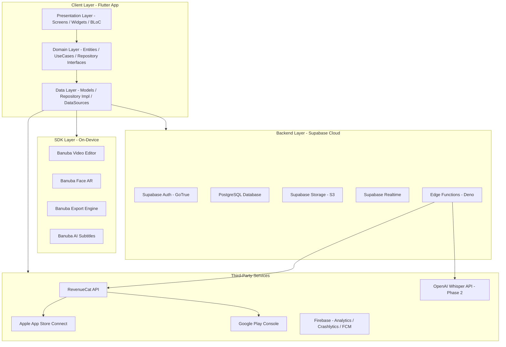
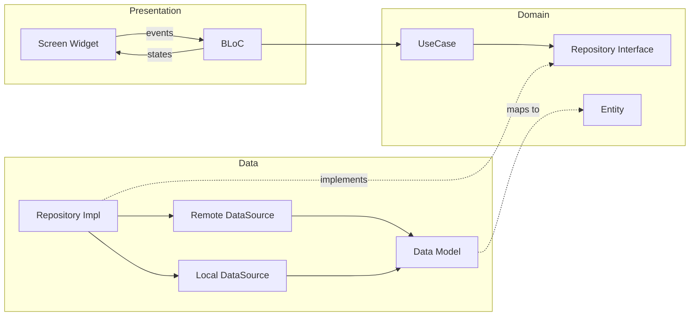
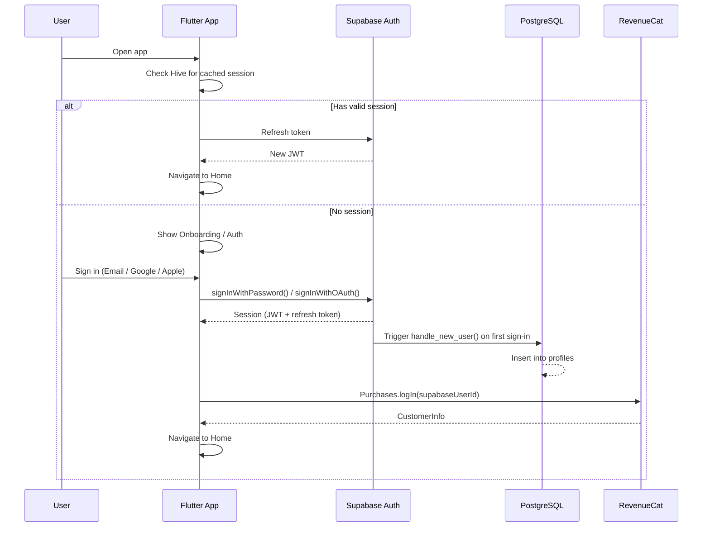
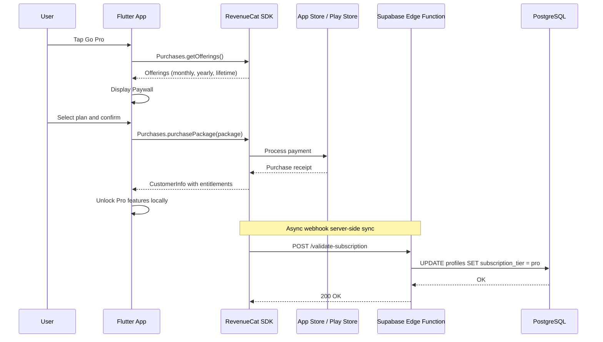
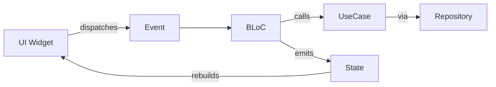

# ClipAI - Technical Requirements Document (TRD)

---

## 1. System Architecture Overview

### 1.1 High-Level Architecture



### 1.2 Clean Architecture Pattern

The app follows **Clean Architecture** with three distinct layers:

- **Presentation Layer:** Flutter Widgets, Screens, BLoC (Business Logic Components). No business logic in widgets.
- **Domain Layer:** Pure Dart entities, abstract repository interfaces, use cases. Zero dependency on Flutter or external packages.
- **Data Layer:** Concrete repository implementations, API/SDK data sources, data models with `fromJson`/`toJson` serialization.



Dependency injection via **GetIt + Injectable** ensures layers remain decoupled.

---

## 2. Technology Stack Specifications

### 2.1 Frontend

| Component        | Technology          | Version          | Purpose                             |
| ---------------- | ------------------- | ---------------- | ----------------------------------- |
| Framework        | Flutter             | 3.19.2+          | Cross-platform UI                   |
| Language         | Dart                | 3.3.0+           | Application logic                   |
| State Management | flutter_bloc        | ^8.1.6           | Predictable state management        |
| Navigation       | go_router           | ^14.0.0          | Declarative routing with deep links |
| DI               | get_it + injectable | ^8.0.0 / ^2.4.0 | Dependency injection                |
| Local Storage    | hive_flutter        | ^1.1.0           | Key-value storage, offline cache    |

### 2.2 Backend (Supabase)

| Component  | Service               | Purpose                                              |
| ---------- | --------------------- | ---------------------------------------------------- |
| Auth       | Supabase GoTrue       | Email, Google, Apple sign-in with JWT                |
| Database   | PostgreSQL 15         | User profiles, projects, templates, exports metadata |
| Storage    | Supabase Storage (S3) | Avatars, template thumbnails, template assets        |
| Serverless | Edge Functions (Deno) | Webhook handlers, AI proxy, server-side logic        |
| Realtime   | Supabase Realtime     | Live subscription status updates (future)            |

### 2.3 Video Editing SDK

| Component    | Package        | Version |
| ------------ | -------------- | ------- |
| Video Editor | ve_sdk_flutter | ^0.37.0 |
| Min Android  | Android 8.0 (API 26) | -  |
| Min iOS      | iOS 15.0+      | -       |

### 2.4 Third-Party Services

| Service              | Package/API                 | Purpose                 |
| -------------------- | --------------------------- | ----------------------- |
| RevenueCat           | purchases_flutter ^8.0.0    | Subscription management |
| Firebase Analytics   | firebase_analytics ^11.0.0  | User analytics, events  |
| Firebase Crashlytics | firebase_crashlytics ^4.0.0 | Crash reporting         |
| Firebase FCM         | firebase_messaging ^15.0.0  | Push notifications      |
| OpenAI Whisper       | REST API (Phase 2)          | Advanced AI captions    |

---

## 3. Banuba Video Editor SDK - Technical Integration

### 3.1 SDK Class Map

The Banuba SDK exposes the following primary classes:

- **`VeSdkFlutter`** - Main SDK entry point with 8 screen launch methods
- **`FeaturesConfig` / `FeaturesConfigBuilder`** - Builder pattern configuration
- **`ExportData`** - Export resolution, watermark settings
- **`ExportResult`** - Returned after export (video paths, preview, metadata)

### 3.2 Available SDK Entry Points

```dart
class VeSdkFlutter {
  Future<ExportResult?> openCameraScreen(token, config, {exportData});
  Future<ExportResult?> openPipScreen(token, config, sourceVideoPath, {exportData});
  Future<ExportResult?> openTrimmerScreen(token, config, sourceVideoPathList, {exportData});
  Future<ExportResult?> openEditorScreen(token, config, sourceVideoPathList, {exportData, trackData});
  Future<ExportResult?> openAiClippingScreen(token, config, {exportData});
  Future<ExportResult?> openTemplatesScreen(token, config, {exportData});
  Future<ExportResult?> openDraftsScreen(token, config, {exportData});
  Future<ExportResult?> openGalleryScreen(token, config, {exportData});
}
```

**ClipAI will use these entry points:**

| Screen               | Method                   | Use Case in ClipAI                   |
| -------------------- | ------------------------ | ------------------------------------ |
| New Project (record) | `openCameraScreen()`     | Record new video from camera         |
| Edit existing video  | `openTrimmerScreen()`    | Import and edit from gallery         |
| Direct edit          | `openEditorScreen()`     | Open editor with pre-selected videos |
| Templates            | `openTemplatesScreen()`  | Open Banuba templates screen         |
| Drafts               | `openDraftsScreen()`     | Resume saved draft projects          |
| AI Clipping          | `openAiClippingScreen()` | AI-powered clip generation           |

### 3.3 FeaturesConfig Specification

```dart
final config = FeaturesConfigBuilder()
    .setCaptions(const Captions(
        uploadUrl: 'CAPTIONS_UPLOAD_URL',
        transcribeUrl: 'CAPTIONS_TRANSCRIBE_URL',
        apiKey: 'CAPTIONS_API_KEY',
    ))
    .setAudioBrowser(AudioBrowser.fromSource(AudioBrowserSource.local))
    .setCameraConfig(const CameraConfig(
        supportsBeauty: true,
        supportsColorEffects: true,
        supportsMasks: true,
        recordModes: [RecordMode.video, RecordMode.photo],
    ))
    .setEditorConfig(const EditorConfig(
        enableVideoAspectFill: true,
        supportsVisualEffects: true,
        supportsColorEffects: true,
        supportsVoiceOver: true,
        supportsAudioEditing: true,
    ))
    .setDraftsConfig(DraftsConfig.fromOption(DraftsOption.askToSave))
    .setVideoDurationConfig(const VideoDurationConfig(
        maxTotalVideoDuration: 180.0,
        videoDurations: [60.0, 30.0, 15.0],
    ))
    .enableEditorV2(true)
    .build();
```

### 3.4 Export Configuration by Subscription Tier

```dart
ExportData _buildExportData({required bool isPro}) {
  return ExportData(
    exportedVideos: [
      ExportedVideo(
        fileName: 'clipai_export',
        videoResolution: isPro ? VideoResolution.fhd1080p : VideoResolution.hd720p,
        useHevcIfPossible: true,
      ),
    ],
    watermark: isPro ? null : const Watermark(
      imagePath: 'assets/watermark/clipai_watermark.png',
      alignment: WatermarkAlignment.bottomRight,
    ),
  );
}
```

### 3.5 Export Result Handling

```dart
void _handleExportResult(ExportResult? result) {
  if (result == null) return; // user cancelled

  // result.videoSources -> List<String> of exported file paths
  // result.previewFilePath -> thumbnail image path (nullable)
  // result.metaFilePath -> metadata JSON path (nullable)
  // result.audioMeta -> audio metadata list (nullable)

  // 1. Save thumbnail to Supabase Storage
  // 2. Create/update project record in Supabase DB
  // 3. Save video to device gallery
  // 4. Track export event in Firebase Analytics
  // 5. Log export in exports table for analytics
}
```

### 3.6 Platform-Specific Configuration

**Android (`android/app/build.gradle`):**

```groovy
android {
    compileSdkVersion 34
    defaultConfig {
        minSdkVersion 26  // Android 8.0+ required by Banuba
        targetSdkVersion 34
    }
}

allprojects {
    repositories {
        maven { url "https://artifacts.banuba.com/repository/maven-releases/" }
    }
}
```

**iOS (`ios/Podfile`):**

```ruby
platform :ios, '15.0'

post_install do |installer|
  installer.pods_project.targets.each do |target|
    target.build_configurations.each do |config|
      config.build_settings['IPHONEOS_DEPLOYMENT_TARGET'] = '15.0'
    end
  end
end
```

**iOS (`Info.plist`) - Required Permissions:**

```xml
<key>NSCameraUsageDescription</key>
<string>ClipAI needs camera access to record videos</string>
<key>NSMicrophoneUsageDescription</key>
<string>ClipAI needs microphone access to record audio</string>
<key>NSPhotoLibraryUsageDescription</key>
<string>ClipAI needs photo library access to import and save videos</string>
<key>NSPhotoLibraryAddUsageDescription</key>
<string>ClipAI needs permission to save edited videos to your gallery</string>
```

**Android (`AndroidManifest.xml`) - Required Permissions:**

```xml
<uses-permission android:name="android.permission.CAMERA" />
<uses-permission android:name="android.permission.RECORD_AUDIO" />
<uses-permission android:name="android.permission.READ_EXTERNAL_STORAGE" />
<uses-permission android:name="android.permission.WRITE_EXTERNAL_STORAGE" />
<uses-permission android:name="android.permission.READ_MEDIA_VIDEO" />
<uses-permission android:name="android.permission.INTERNET" />
```

---

## 4. Supabase Backend - Technical Design

### 4.1 Database Schema (Full DDL)

```sql
-- Enable UUID extension
CREATE EXTENSION IF NOT EXISTS "uuid-ossp";

------------------------------------------------------------
-- PROFILES TABLE
------------------------------------------------------------
CREATE TABLE public.profiles (
    id UUID PRIMARY KEY REFERENCES auth.users(id) ON DELETE CASCADE,
    email TEXT NOT NULL,
    display_name TEXT,
    avatar_url TEXT,
    subscription_tier TEXT NOT NULL DEFAULT 'free'
        CHECK (subscription_tier IN ('free', 'pro')),
    revenuecat_id TEXT UNIQUE,
    total_exports INTEGER NOT NULL DEFAULT 0,
    onboarding_completed BOOLEAN NOT NULL DEFAULT false,
    created_at TIMESTAMPTZ NOT NULL DEFAULT NOW(),
    updated_at TIMESTAMPTZ NOT NULL DEFAULT NOW()
);

-- Auto-update updated_at
CREATE OR REPLACE FUNCTION update_updated_at()
RETURNS TRIGGER AS $$
BEGIN
    NEW.updated_at = NOW();
    RETURN NEW;
END;
$$ LANGUAGE plpgsql;

CREATE TRIGGER profiles_updated_at
    BEFORE UPDATE ON public.profiles
    FOR EACH ROW EXECUTE FUNCTION update_updated_at();

-- Auto-create profile on signup
CREATE OR REPLACE FUNCTION handle_new_user()
RETURNS TRIGGER AS $$
BEGIN
    INSERT INTO public.profiles (id, email, display_name, avatar_url)
    VALUES (
        NEW.id,
        NEW.email,
        COALESCE(NEW.raw_user_meta_data->>'full_name', NEW.raw_user_meta_data->>'name'),
        NEW.raw_user_meta_data->>'avatar_url'
    );
    RETURN NEW;
END;
$$ LANGUAGE plpgsql SECURITY DEFINER;

CREATE TRIGGER on_auth_user_created
    AFTER INSERT ON auth.users
    FOR EACH ROW EXECUTE FUNCTION handle_new_user();

------------------------------------------------------------
-- TEMPLATES TABLE
------------------------------------------------------------
CREATE TABLE public.templates (
    id UUID PRIMARY KEY DEFAULT gen_random_uuid(),
    name TEXT NOT NULL,
    description TEXT,
    category TEXT NOT NULL
        CHECK (category IN ('trending', 'business', 'lifestyle', 'funny', 'music', 'tutorial')),
    thumbnail_url TEXT NOT NULL,
    preview_video_url TEXT,
    template_data JSONB NOT NULL DEFAULT '{}',
    aspect_ratio TEXT NOT NULL DEFAULT '9:16'
        CHECK (aspect_ratio IN ('9:16', '16:9', '1:1', '4:5')),
    duration_seconds INTEGER,
    is_pro BOOLEAN NOT NULL DEFAULT false,
    is_active BOOLEAN NOT NULL DEFAULT true,
    download_count INTEGER NOT NULL DEFAULT 0,
    sort_order INTEGER NOT NULL DEFAULT 0,
    tags TEXT[] DEFAULT '{}',
    created_at TIMESTAMPTZ NOT NULL DEFAULT NOW()
);

CREATE INDEX idx_templates_category ON public.templates(category);
CREATE INDEX idx_templates_is_active ON public.templates(is_active);
CREATE INDEX idx_templates_is_pro ON public.templates(is_pro);

------------------------------------------------------------
-- PROJECTS TABLE
------------------------------------------------------------
CREATE TABLE public.projects (
    id UUID PRIMARY KEY DEFAULT gen_random_uuid(),
    user_id UUID NOT NULL REFERENCES public.profiles(id) ON DELETE CASCADE,
    title TEXT NOT NULL DEFAULT 'Untitled',
    thumbnail_path TEXT,
    duration_seconds INTEGER,
    template_id UUID REFERENCES public.templates(id) ON DELETE SET NULL,
    project_meta JSONB DEFAULT '{}',
    status TEXT NOT NULL DEFAULT 'draft'
        CHECK (status IN ('draft', 'editing', 'exported')),
    last_exported_at TIMESTAMPTZ,
    created_at TIMESTAMPTZ NOT NULL DEFAULT NOW(),
    updated_at TIMESTAMPTZ NOT NULL DEFAULT NOW()
);

CREATE INDEX idx_projects_user_id ON public.projects(user_id);
CREATE INDEX idx_projects_status ON public.projects(status);

CREATE TRIGGER projects_updated_at
    BEFORE UPDATE ON public.projects
    FOR EACH ROW EXECUTE FUNCTION update_updated_at();

------------------------------------------------------------
-- EXPORTS TABLE
------------------------------------------------------------
CREATE TABLE public.exports (
    id UUID PRIMARY KEY DEFAULT gen_random_uuid(),
    user_id UUID NOT NULL REFERENCES public.profiles(id) ON DELETE CASCADE,
    project_id UUID REFERENCES public.projects(id) ON DELETE SET NULL,
    format TEXT NOT NULL DEFAULT 'mp4'
        CHECK (format IN ('mp4', 'mov', 'gif', 'webm')),
    resolution TEXT NOT NULL DEFAULT '720p'
        CHECK (resolution IN ('360p', '480p', '720p', '1080p', '1440p', '4k')),
    file_size_mb NUMERIC(10, 2),
    duration_seconds INTEGER,
    used_ai_captions BOOLEAN NOT NULL DEFAULT false,
    used_bg_removal BOOLEAN NOT NULL DEFAULT false,
    exported_at TIMESTAMPTZ NOT NULL DEFAULT NOW()
);

CREATE INDEX idx_exports_user_id ON public.exports(user_id);

------------------------------------------------------------
-- APP_SETTINGS TABLE (key-value for remote config)
------------------------------------------------------------
CREATE TABLE public.app_settings (
    key TEXT PRIMARY KEY,
    value JSONB NOT NULL,
    updated_at TIMESTAMPTZ NOT NULL DEFAULT NOW()
);
```

### 4.2 Row Level Security Policies

```sql
-- PROFILES
ALTER TABLE public.profiles ENABLE ROW LEVEL SECURITY;

CREATE POLICY "Users can view own profile"
    ON public.profiles FOR SELECT
    USING (auth.uid() = id);

CREATE POLICY "Users can update own profile"
    ON public.profiles FOR UPDATE
    USING (auth.uid() = id)
    WITH CHECK (auth.uid() = id);

-- PROJECTS
ALTER TABLE public.projects ENABLE ROW LEVEL SECURITY;

CREATE POLICY "Users can view own projects"
    ON public.projects FOR SELECT
    USING (auth.uid() = user_id);

CREATE POLICY "Users can insert own projects"
    ON public.projects FOR INSERT
    WITH CHECK (auth.uid() = user_id);

CREATE POLICY "Users can update own projects"
    ON public.projects FOR UPDATE
    USING (auth.uid() = user_id)
    WITH CHECK (auth.uid() = user_id);

CREATE POLICY "Users can delete own projects"
    ON public.projects FOR DELETE
    USING (auth.uid() = user_id);

-- TEMPLATES
ALTER TABLE public.templates ENABLE ROW LEVEL SECURITY;

CREATE POLICY "Authenticated users can view active templates"
    ON public.templates FOR SELECT
    USING (auth.role() = 'authenticated' AND is_active = true);

-- EXPORTS
ALTER TABLE public.exports ENABLE ROW LEVEL SECURITY;

CREATE POLICY "Users can view own exports"
    ON public.exports FOR SELECT
    USING (auth.uid() = user_id);

CREATE POLICY "Users can insert own exports"
    ON public.exports FOR INSERT
    WITH CHECK (auth.uid() = user_id);

-- APP_SETTINGS
ALTER TABLE public.app_settings ENABLE ROW LEVEL SECURITY;

CREATE POLICY "Authenticated users can read app settings"
    ON public.app_settings FOR SELECT
    USING (auth.role() = 'authenticated');
```

### 4.3 Storage Buckets Configuration

| Bucket            | Access                       | Max File Size | Allowed MIME Types                |
| ----------------- | ---------------------------- | ------------- | --------------------------------- |
| `avatars`         | Public                       | 2 MB          | image/jpeg, image/png, image/webp |
| `thumbnails`      | Authenticated (user-scoped)  | 5 MB          | image/jpeg, image/png             |
| `template-assets` | Public (read), Admin (write) | 50 MB         | image/*, video/*                  |

```sql
CREATE POLICY "Avatar upload - own folder"
    ON storage.objects FOR INSERT
    WITH CHECK (
        bucket_id = 'avatars' AND
        auth.uid()::text = (storage.foldername(name))[1]
    );

CREATE POLICY "Avatar read - public"
    ON storage.objects FOR SELECT
    USING (bucket_id = 'avatars');

CREATE POLICY "Thumbnail upload - own folder"
    ON storage.objects FOR INSERT
    WITH CHECK (
        bucket_id = 'thumbnails' AND
        auth.uid()::text = (storage.foldername(name))[1]
    );

CREATE POLICY "Thumbnail read - own folder"
    ON storage.objects FOR SELECT
    USING (
        bucket_id = 'thumbnails' AND
        auth.uid()::text = (storage.foldername(name))[1]
    );
```

---

## 5. Authentication Flow



### Auth Repository Interface

```dart
abstract class AuthRepository {
  Stream<AuthState> get authStateChanges;
  Future<UserEntity?> get currentUser;
  Future<UserEntity> signInWithEmail(String email, String password);
  Future<UserEntity> signUpWithEmail(String email, String password, String displayName);
  Future<UserEntity> signInWithGoogle();
  Future<UserEntity> signInWithApple();
  Future<void> signOut();
  Future<void> resetPassword(String email);
  Future<void> deleteAccount();
}
```

### JWT Token Management

- Supabase Flutter SDK handles token refresh automatically
- JWT tokens stored securely by Supabase SDK internally
- Session persistence enabled by default in `supabase_flutter`
- Token expiry: 3600s (1 hour), auto-refreshed 60s before expiry

---

## 6. Subscription System - RevenueCat Integration

### 6.1 Product Configuration

| Product ID            | Platform      | Type                        | Price     |
| --------------------- | ------------- | --------------------------- | --------- |
| `clipai_pro_monthly`  | iOS + Android | Auto-renewable subscription | $9.99/mo  |
| `clipai_pro_yearly`   | iOS + Android | Auto-renewable subscription | $59.99/yr |
| `clipai_pro_lifetime` | iOS + Android | Non-consumable              | $99.99    |

**Entitlement:** `pro_access`
**Offering:** `default`

### 6.2 Subscription Flow



### 6.3 Feature Gating Logic

```dart
class SubscriptionService {
  static const String entitlementId = 'pro_access';

  Future<bool> get isProUser async {
    final customerInfo = await Purchases.getCustomerInfo();
    return customerInfo.entitlements.active.containsKey(entitlementId);
  }

  bool canExportHD(bool isPro) => isPro;
  bool canExport4K(bool isPro) => isPro;
  bool canRemoveWatermark(bool isPro) => isPro;
  bool canUseBackgroundRemoval(bool isPro) => isPro;
  bool canAccessAllTemplates(bool isPro) => isPro;
  bool canUseAdvancedCaptions(bool isPro) => isPro;

  int maxFreeTemplates = 3;
}
```

### 6.4 RevenueCat Webhook Edge Function

```typescript
// supabase/functions/validate-subscription/index.ts
import { serve } from "https://deno.land/std@0.177.0/http/server.ts";
import { createClient } from "https://esm.sh/@supabase/supabase-js@2";

serve(async (req: Request) => {
  const authHeader = req.headers.get("Authorization");
  if (authHeader !== `Bearer ${Deno.env.get("REVENUECAT_WEBHOOK_SECRET")}`) {
    return new Response("Unauthorized", { status: 401 });
  }

  const body = await req.json();
  const event = body.event;
  const userId = event.app_user_id;
  const eventType = event.type;

  const supabase = createClient(
    Deno.env.get("SUPABASE_URL")!,
    Deno.env.get("SUPABASE_SERVICE_ROLE_KEY")!
  );

  const grantEvents = [
    "INITIAL_PURCHASE", "RENEWAL", "UNCANCELLATION",
    "NON_RENEWING_PURCHASE", "PRODUCT_CHANGE"
  ];
  const revokeEvents = [
    "CANCELLATION", "EXPIRATION", "BILLING_ISSUE"
  ];

  let tier = "free";
  if (grantEvents.includes(eventType)) {
    tier = "pro";
  } else if (revokeEvents.includes(eventType)) {
    tier = "free";
  }

  const { error } = await supabase
    .from("profiles")
    .update({ subscription_tier: tier })
    .eq("id", userId);

  if (error) {
    return new Response(JSON.stringify({ error: error.message }), { status: 400 });
  }

  return new Response(JSON.stringify({ success: true }), { status: 200 });
});
```

---

## 7. BLoC State Management - Technical Specs

### 7.1 BLoC Architecture Pattern



### 7.2 Auth BLoC

```dart
// Events
sealed class AuthEvent extends Equatable {}
class AuthCheckRequested extends AuthEvent {}
class AuthSignInWithEmail extends AuthEvent { ... }
class AuthSignUpWithEmail extends AuthEvent { ... }
class AuthSignInWithGoogle extends AuthEvent {}
class AuthSignInWithApple extends AuthEvent {}
class AuthSignOutRequested extends AuthEvent {}

// States
sealed class AuthState extends Equatable {}
class AuthInitial extends AuthState {}
class AuthLoading extends AuthState {}
class AuthAuthenticated extends AuthState { final UserEntity user; }
class AuthUnauthenticated extends AuthState {}
class AuthError extends AuthState { final String message; }
```

### 7.3 Home BLoC

```dart
// Events
sealed class HomeEvent extends Equatable {}
class HomeLoadRequested extends HomeEvent {}
class HomeRefreshRequested extends HomeEvent {}

// States
sealed class HomeState extends Equatable {}
class HomeInitial extends HomeState {}
class HomeLoading extends HomeState {}
class HomeLoaded extends HomeState {
  final UserEntity user;
  final List<ProjectEntity> recentProjects;
  final List<TemplateEntity> featuredTemplates;
  final bool isPro;
}
class HomeError extends HomeState { final String message; }
```

### 7.4 Template BLoC

```dart
// Events
sealed class TemplateEvent extends Equatable {}
class TemplatesLoadRequested extends TemplateEvent {}
class TemplatesCategoryChanged extends TemplateEvent { final String category; }
class TemplateSelected extends TemplateEvent { final TemplateEntity template; }

// States
sealed class TemplateState extends Equatable {}
class TemplatesInitial extends TemplateState {}
class TemplatesLoading extends TemplateState {}
class TemplatesLoaded extends TemplateState {
  final List<TemplateEntity> templates;
  final String selectedCategory;
  final bool isPro;
}
class TemplatesError extends TemplateState { final String message; }
```

### 7.5 Export BLoC

```dart
// Events
sealed class ExportEvent extends Equatable {}
class ExportStarted extends ExportEvent { ... }
class ExportResultReceived extends ExportEvent { ... }
class ExportSaveToGallery extends ExportEvent { ... }

// States
sealed class ExportState extends Equatable {}
class ExportInitial extends ExportState {}
class ExportInProgress extends ExportState {}
class ExportCompleted extends ExportState { ... }
class ExportSavedToGallery extends ExportState {}
class ExportError extends ExportState { final String message; }
```

---

## 8. Domain Entities

```dart
class UserEntity extends Equatable {
  final String id;
  final String email;
  final String? displayName;
  final String? avatarUrl;
  final String subscriptionTier;
  final bool onboardingCompleted;
  final DateTime createdAt;
}

class ProjectEntity extends Equatable {
  final String id;
  final String userId;
  final String title;
  final String? thumbnailPath;
  final int? durationSeconds;
  final String? templateId;
  final Map<String, dynamic> projectMeta;
  final String status;
  final DateTime createdAt;
  final DateTime updatedAt;
}

class TemplateEntity extends Equatable {
  final String id;
  final String name;
  final String? description;
  final String category;
  final String thumbnailUrl;
  final String? previewVideoUrl;
  final Map<String, dynamic> templateData;
  final String aspectRatio;
  final int? durationSeconds;
  final bool isPro;
  final int downloadCount;
  final List<String> tags;
}

class ExportEntity extends Equatable {
  final String id;
  final String userId;
  final String? projectId;
  final String format;
  final String resolution;
  final double? fileSizeMb;
  final int? durationSeconds;
  final bool usedAiCaptions;
  final bool usedBgRemoval;
  final DateTime exportedAt;
}
```

---

## 9. Error Handling Strategy

### Error Type Hierarchy

```dart
sealed class AppException implements Exception {
  final String message;
  final String? code;
  const AppException(this.message, {this.code});
}

class AuthException extends AppException { ... }
class NetworkException extends AppException { ... }
class StorageException extends AppException { ... }
class ExportException extends AppException { ... }
class SubscriptionException extends AppException { ... }
class BanubaException extends AppException { ... }
```

### Result Pattern

```dart
sealed class Result<T> {
  const Result();
}
class Success<T> extends Result<T> {
  final T data;
  const Success(this.data);
}
class Failure<T> extends Result<T> {
  final AppException exception;
  const Failure(this.exception);
}
```

---

## 10. Performance Requirements

| Metric                      | Target                       | Measurement                |
| --------------------------- | ---------------------------- | -------------------------- |
| App cold start              | < 3 seconds                  | Firebase Performance       |
| Auth sign-in                | < 2 seconds                  | Firebase Performance       |
| Template list load          | < 1 second                   | First meaningful paint     |
| Video editor launch         | < 2 seconds                  | Time from tap to Banuba UI |
| Export (30s video, 720p)    | < 30 seconds                 | Banuba export engine       |
| Export (30s video, 1080p)   | < 60 seconds                 | Banuba export engine       |
| App size (installed)        | < 150 MB                     | Store listing              |
| Memory usage during editing | < 500 MB                     | Android Studio profiler    |
| API response time           | < 500ms (p95)                | Supabase dashboard         |
| Frame rate                  | 60 fps (non-editing screens) | Flutter DevTools           |

---

## 11. Security Requirements

- All API calls over HTTPS/TLS 1.3
- Supabase anon key is public-safe (RLS enforces access)
- Service role key ONLY in Edge Functions (never in client)
- Banuba license token stored in constants file excluded from VCS
- RevenueCat webhook secret stored as Supabase project secret
- Use `--dart-define-from-file` to inject secrets at build time for production

---

## 12. Analytics Events

| Event Name            | Parameters                                             | Trigger                    |
| --------------------- | ------------------------------------------------------ | -------------------------- |
| `app_open`            | `platform`, `version`                                  | App launch                 |
| `onboarding_complete` | `time_spent_seconds`                                   | Finish onboarding          |
| `sign_up`             | `method` (email/google/apple)                          | New account created        |
| `sign_in`             | `method`                                               | Existing user login        |
| `editor_opened`       | `source` (camera/gallery/template)                     | Video editor launched      |
| `template_selected`   | `template_id`, `category`, `is_pro`                    | Template tapped            |
| `ai_captions_used`    | `video_duration`, `tier`                               | AI captions applied        |
| `bg_removal_used`     | `tier`                                                 | Background removal used    |
| `export_started`      | `format`, `resolution`, `duration`                     | Export initiated           |
| `export_completed`    | `format`, `resolution`, `file_size_mb`, `time_seconds` | Export finished            |
| `paywall_shown`       | `trigger` (feature_gate/settings/banner)               | Paywall displayed          |
| `purchase_started`    | `product_id`                                           | User taps buy              |
| `purchase_completed`  | `product_id`, `revenue`                                | Purchase confirmed         |
| `purchase_cancelled`  | `product_id`                                           | User cancels purchase flow |

---

## 13. Device Compatibility Matrix

### Android

| Requirement  | Value                          |
| ------------ | ------------------------------ |
| Min SDK      | 26 (Android 8.0)               |
| Target SDK   | 34 (Android 14)                |
| GPU          | OpenGL ES 3.0+                 |
| RAM          | 3 GB minimum, 4 GB recommended |
| Camera       | Camera2 API required           |
| Architecture | arm64-v8a, armeabi-v7a         |

### iOS

| Requirement | Value              |
| ----------- | ------------------ |
| Min iOS     | 15.0               |
| Devices     | iPhone 8 and newer |
| Xcode       | 14.0+              |
| Swift       | 5.0+               |
| RAM         | 3 GB minimum       |
